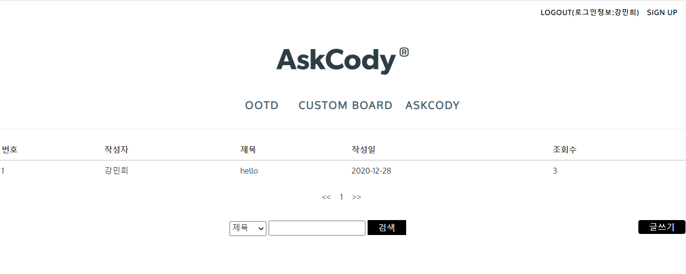

# Ask_Cody 
> :question: What to wear today?:question: :exclamation:

## Motivation
>  When you are wondering what to wear, you can find it by setting the color and category you want.   
> You can also make it into a codibook and save it.


## ScreenShot
> 메인화면 (main)

</img>

> 코디 찾기(fineder)

</img>

> 로그인/회원가입 (Login/Sign Up)

</img>
</img>

> 게시판 (Board CURD fin)

</img>

> 코디북 (Coordi Book)

</img>

> view Diagram

</img>

## Environment [tech, version, tool, etc]
### OS
- windows10

### Database
- Oracle Database 11g Expression Edition `11.2.0.2.0`
- ojdbc6

### Language
- java `(jdk version) 1.8.0_271`
    - jsp/servlet
- javaScript

### Library
- jQuery `1.12.4`
- jQuery UI `1.12.1`

### server
- Tomcat `9.0.41`

### Tool
- sql developer (change to dbeaver)
- eclipse

## Installation
- clone this project
- Please install oracle `xe11g`
    - Create account (`ID: bit, PW: bit`)
    - ojdbc6 download & build path configuration
    - Granting authority to Database (in sys, system.. account)
        ```sql
        GRANT CONNECT, DB, RESOURCE TO bit;
        ```
    - Oracle Listener start
        ```cmd
        lsnrctl start
        ```
- download [dbinfo.txt file](https://github.com/minhee0327/Ask_Cody/blob/master/dbinfo.txt) and put in the corresponding path (`C:\lib\dbinfo.txt`)
- Tomcat server linkage (eclipse)
    - [Windows] - [Preferences]
    - [Server] - [Runtime Environments] - [add]
    - Apache Tomcat v9.0 select
    - [reference](https://all-record.tistory.com/49)
- After installation is complete, you can use the project.

## Contribute
> 팀원
- [danniel0458](https://github.com/daniel0458) : 조장, 게시판 CURD, 프로젝트 통합관리
- [jakeshin89](https://github.com/jakeshin89): 옷 찾기(finder)
- [jiji0107](https://github.com/jiji0107): 로그인/회원가입
- [minhee0327](https://github.com/minhee0327/): 코디북(coordibook)

> 프로젝트 기간
- 2019.09.16 - 2019. 09.27

> history참조
- [링크(완성본 아님)](https://github.com/daniel0458/team2project)
- 
